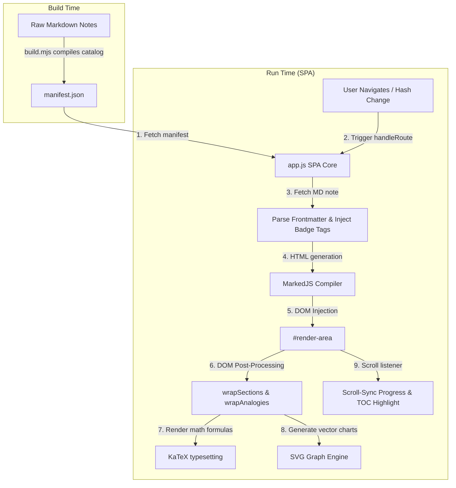

# 📚 KTU Exam Notes

[](#)
[](#)
[](#)
[](package.json)

> A high-performance, minimalist, and distraction-free exam revision dashboard designed for KTU B.Tech engineering students. It dynamically loads study notes, typesets complex math equations, and renders interactive visual containers for rapid learning.

---

## 🛠️ System Architecture & Data Flow

The application is split into a **static build phase** and a **dynamic client-side execution phase**. Below is the data flow showing how notes progress from raw markdown files to an interactive browser experience:



### Technical Step-by-Step Flow:
1. **Compilation (`build.mjs`)**: A Node.js compiler processes note files in `notes/` by parsing YAML metadata and scanning for key tags to generate a consolidated `manifest.json`.
2. **Bootstrapping**: On load, the Single Page Application (`app.js`) fetches `manifest.json` to configure courses, modules, and the main navigation directory.
3. **SPA Routing**: The app intercepts URL hashes (e.g., `#CD/Module_1_Study_Guide`). When a hash changes, it dynamically fetches the corresponding markdown file.
4. **Pre-processing**: YAML frontmatter is stripped, and priority badges (`[SURE SHOT]`, `[HIGH YIELD]`, etc.) are converted into styled HTML badges via regular expressions.
5. **MarkedJS Rendering**: The modified markdown content is compiled into semantic HTML and injected into the rendering viewport.
6. **DOM Transformations**: 
   - **Dynamic Cards**: Slices heading blocks and groups them into containers depending on keyword triggers.
   - **Analogy Callouts**: Searches for blockquotes beginning with "Analogy:" and styles them with a custom alert layout.
   - **Graph Conversion**: Intercepts code blocks containing coordinate characters and injects vector SVGs.
7. **LaTeX typesetting**: The KaTeX engine formats mathematical and scientific equations.
8. **Scroll Tracking**: Active scroll events track viewport position relative to headings, updating the header progress bar and keeping the sidebar table of contents highlighted.

---

## ✨ Features

* ⚡ **Single Page Application (SPA)**: Fast client-side hash routing (`#subject/module`) without page refreshes.
* 📖 **Scroll-Sync Table of Contents**: Real-time viewport tracking highlights the active topic in the sidebar navigation dynamically.
* 💡 **Dynamic Section Cards**: Automatically wraps markdown sections into styled containers (*Theory*, *Worked Examples*, *Exam Tips*, and *Rapid Recall*) based on header keywords.
* 📐 **Hardware-Accelerated Math**: High-performance mathematical typesetting powered by KaTeX.
* 📊 **ASCII-to-SVG Charts**: Automatically converts textual coordinate blocks inside note files into clean, vector diagrams.
* 🔍 **Zero-Latency Search**: Full client-side text indexing for searching courses and modules instantly.
* 🎨 **Minimalist & Fluid Design**: Editorial layouts, sleek dark modes, theme transitions, and snappy micro-interactions.
* 🖨️ **Print-Ready Styles**: CSS stylesheets optimize layouts specifically for printing clean physical revision sheets.

---

## 📂 Project Structure

* **[notes/](file:///notes/)**: Subject directories containing raw markdown study guides (e.g. `CD/` for Compiler Design, `IEFT/` for Industrial Economics).
* **[manifest.json](file:///manifest.json)**: The centralized registry mapping subject IDs, modules, path locations, and pre-calculated topics.
* **[build.mjs](file:///build.mjs)**: Manifest compiler script using `gray-matter` to parse raw notes.
* **[app.js](file:///app.js)**: Core client logic implementing routing, badge matching, card wrapping, graph replacement, search indexing, and transitions.
* **[style.css](file:///style.css)**: Perceptually uniform OKLCH color palettes, dark/light theme systems, print stylesheets, and UI styling.
* **[index.html](file:///index.html)**: Main HTML structure linking third-party libraries (Marked.js, KaTeX) and bootstrapping the SPA.

---

## 📝 Note Formatting Guide

Markdown notes are placed under `notes/<SUBJECT_ID>/`. To enable full interactivity, note files must follow these formatting conventions:

### 1. Frontmatter Header
Every note file must start with a YAML frontmatter block containing its title and sorting order:
```yaml
---
title: "Module 1: Introduction to Compilers"
order: 1
---
```

### 2. Priority Badges
Write raw text tags to automatically inject formatted badges during rendering:
* `[SURE SHOT]` $\rightarrow$ ★ SURE SHOT (essential exam concepts)
* `[HIGH YIELD]` $\rightarrow$ ↑ HIGH YIELD (high probability topics)
* `[REPEATED PYQ: 2022]` $\rightarrow$ ↻ PYQ: 2022 (previous years' questions)

### 3. Keyword-Based Cards
Heading level 3 (`###`) elements starting with `A. `, `B. `, etc., are converted to themed containers when they contain these keywords:
* **what is this** $\rightarrow$ `💡 What is this?` (Amber Card)
* **theory** $\rightarrow$ `📖 Theory` (Blue Card)
* **example** $\rightarrow$ `∑ Worked Examples` (Green Card)
* **exam** $\rightarrow$ `✍ Exam Tips` (Purple Card)
* **recall / test** $\rightarrow$ `⚡ Rapid Recall` (Red Card)

### 4. Analogy Callouts
Create styled blocks by beginning blockquotes with `**Analogy:**`:
```markdown
> **Analogy:** Imagine a factory assembly line sorting raw materials...
```

### 5. Vector Graphs
Textual code blocks marked with coordinate characters `^` and `|` are replaced with inline vector graphics when specific keywords are matched.

---

## 🚀 Getting Started

Follow these steps to build the note manifest and serve the project locally:

### 1. Install Dependencies & Build
Install compilation tools and generate the manifest index:
```bash
npm install
node build.mjs
```

### 2. Launch Local Server
Serve the project directory using any static web server. For example, using Node's `serve`:
```bash
npx serve -p 3000
```
Open `http://localhost:3000` in your web browser.
